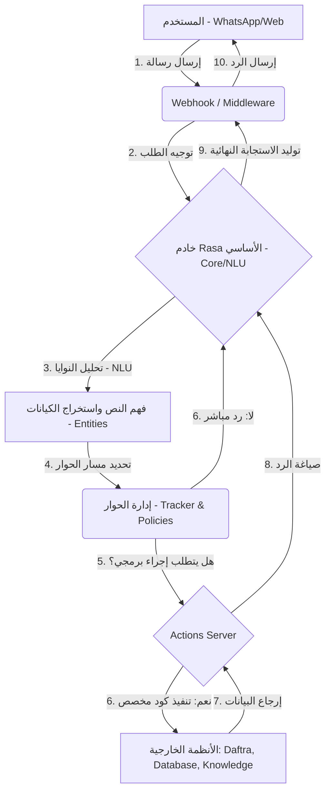

# التقرير الشامل: البنية التحتية ودورة حياة بوت "مجموعة العزب" (End-to-End)

يقدم هذا التقرير شرحاً تفصيلياً معمارياً للمشروع، يوضح دورة حياة الرسالة منذ انطلاقها من المستخدم وحتى استلامه للرد، بالإضافة إلى تفصيل شامل لدور كل مجلد وملف في النظام الخلفي (Backend) للبوت.

---

## 1. دورة حياة البوت (End-to-End Message Lifecycle)

تتم معالجة أي رسالة يرسلها المستخدم عبر عدة محطات متسلسلة لضمان تقديم رد ذكي ودقيق:

### تفصيل المحطات:
1. **الاستقبال (Webhook/Middleware):** يقوم العميل (مثل واتساب أو واجهة الويب) بإرسال رسالة نصية أو صوتية. يستقبل مجلد `webhook` هذا الطلب، ويقوم بمعالجة الأمان، التوثيق (Auth)، وتنسيق البيانات.
2. **الفهم والتحليل (Rasa NLU):** يستلم محرك Rasa الرسالة ويحللها لفهم القصد (Intent) واستخراج المتغيرات (Entities) مثل الأرقام أو التواريخ.
3. **إدارة الحوار (Dialogue Management):** بناءً على القواعد (Rules) والقصص (Stories)، يقرر البوت الخطوة التالية، هل يرد مباشرة أم ينفذ إجراءً مخصصاً (Custom Action)؟
4. **تنفيذ المهام (Action Server):** إذا احتاج البوت لاسترجاع بيانات من نظام "دفترة" أو البحث في "قاعدة المعرفة"، يرسل طلباً إلى خادم الإجراءات `actions` الذي يتصل بواجهات برمجة التطبيقات (APIs).
5. **الرد النهائي:** يرسل البوت الرد المصاغ باللغة الأنيقة المخزنة في مجلد `domain` عائداً إلى المستخدم عبر الـ Webhook.

---

## 2. الهيكل التنظيمي للمجلدات والملفات

يعتمد المشروع على هندسة برمجية مركبة تفصل بين واجهات التخاطب (Frontend/Webhook)، الذكاء الاصطناعي (Rasa)، والمنطق البرمجي (Action Server).

### المجلدات الأساسية لذكاء البوت (Rasa Core Engine):

- 📁 **`data/` (مجلد البيانات والتدريب)**
  يحتوي على كافة البيانات التي "يتعلم" منها البوت. ينقسم إلى:
  - `nlu/`: أمثلة لتدريب البوت على فهم نوايا المستخدم بكلمات وجمل مختلفة.
  - `stories/` & `rules/`: سيناريوهات المحادثة والمسارات المنطقية والقواعد الصارمة.
  - `flows/`: التحكم المتقدم في تدفق الحوارات المعقدة.

- 📁 **`domain/` (العقل المدبر للردود والمتغيرات)**
  هو دليل البوت الذي يعرفه بنفسه وبمحيطه. يحتوي على:
  - تعريف النوايا (Intents) والكيانات (Entities).
  - الاستجابات (Responses) مقسمة لملفات متخصصة (مثل `uberfix.yml`, `luxury_finishing.yml`) لضمان سهولة الإدارة والنبرة الاحترافية.
  - الذاكرة المؤقتة للمحادثة (Slots).

- 📁 **`models/`**
  يخزن النماذج الناتجة بعد إجراء عملية التدريب (`rasa train`). عند تشغيل البوت، يتم تحميل أحدث نموذج من هنا للرد على العملاء.

### المجلدات الأساسية للبرمجة المخصصة والربط الخارجي:

- 📁 **`actions/` (خادم المهام البرمجية Action Server)**
  يحتوي على كود Python الذي يُنفذ العمليات التي تتطلب منطقاً برمجياً أو تواصلاً مع أنظمة خارجية.
  - `action_daftra_ops.py`: ربط مباشر مع نظام تخطيط الموارد "دفترة" (لإصدار الفواتير، الاستعلام عن العملاء).
  - `knowledge_search.py`: البحث الذكي في قواعد المعرفة الخاصة بالشركة للرد على الأسئلة المعقدة.
  - `action_brand_navigator.py` وغيرها: لمعالجة الحوارات المتقدمة ونقل البيانات وحفظها.

- 📁 **`webhook/` (الوسيط والاتصالات الخارجية)**
  مبني غالباً باستخدام إطار عمل (FastAPI).
  - `server.py` و `routers/`: استقبال رسائل الواتساب أو قنوات الاتصال الأخرى وتوجيهها إلى خادم Rasa الأساسي بعد التأكد من صحتها (Validation/Auth).
  - `middleware.py`: تتبع الجلسات وإدارة الأمن.

### مجلدات واجهات التحكم وقواعد المعرفة:

- 📁 **`azabot/` (لوحة تحكم المشرف Admin Panel)**
  مشروع Frontend مبني بـ React/TypeScript، يعمل كلوحة تحكم خلفية (Dashboard) للمشرفين لمتابعة أداء البوت، إعدادات النظام، ومراجعة بيانات العملاء.

- 📁 **`knowledge/` (قاعدة المعرفة)**
  يحتوي على مستندات وملفات تمد البوت بالمعلومات حول أسعار الشركة، سياساتها، وشروط الضمان، بحيث يمكنه الإجابة على الأسئلة الديناميكية التي لم يُدرّب عليها مسبقاً كنص ثابت.

- 📁 **`database/`**
  يحتوي على بيانات حفظ الجلسات أو التخزين المحلي المؤقت (SQLite أو النسخ الاحتياطية).

### الملفات الجذرية الهامة (Root Files):

- 📄 **`config.yml`**: إعدادات خط الأنابيب (Pipeline) الخاص بالذكاء الاصطناعي (مثل خوارزميات معالجة اللغة الطبيعية والسياسات).
- 📄 **`endpoints.yml`**: يعرف البوت كيفية الاتصال بخادم الإجراءات البرمجية `actions` وكيفية الاتصال بقنوات الرسائل.
- 📄 **`credentials.yml`**: إعدادات كلمات المرور ومفاتيح الـ API للقنوات المختلفة مثل WhatsApp و Slack وغيرها.
- 📄 **`.env`**: يحتوي على المتغيرات البيئية الحساسة كأكواد الربط مع أنظمة الدفع، نظام "دفترة"، ومفاتيح تشفير الخادم.

> [!TIP]
> **نصيحة للإدارة والتطوير:**
> يضمن هذا الهيكل "الفصل بين الاهتمامات" (Separation of Concerns). إذا أردت تعديل الردود الكلامية، ستتجه لـ `domain`. وإذا أردت تعديل طريقة دمج الفواتير، ستتجه لـ `actions`. وإذا أردت ربط البوت بتطبيق جديد، ستتجه لـ `webhook`.
